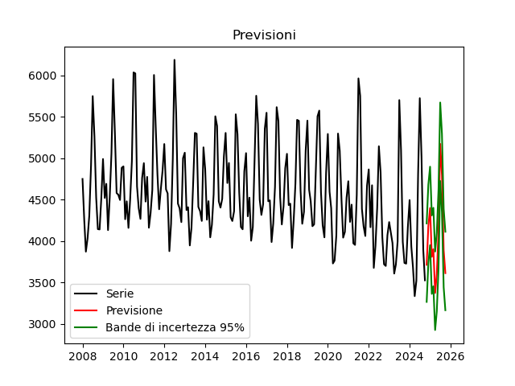
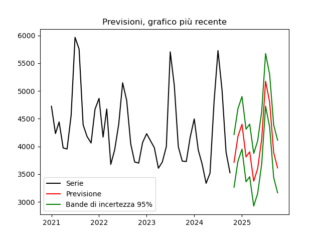

# 📊 Energy Consumption Forecasting in Greece

**Author:** Matteo Scardala  
**Date:** December 2024  

## 📌 Overview
This project analyzes historical energy consumption data in Greece and forecasts future demand using statistical and machine learning methods. The dataset spans **16 years** (2008-2024) with **monthly energy consumption data (GWh)** sourced from [Eurostat](https://ec.europa.eu/eurostat/databrowser/view/ei_isen_m__custom_14777876/default/table?lang=en).

## 📂 Repository Structure
- **📄 `tabella`** → Contains the dataset used for analysis.
- **📄 `analisi/`** → Preliminar analysis of data.
- **📄 `previsione/`** → Prediction for 2025.
- **📄 `README.md`** → Project documentation.

## 🔍 Data Analysis
### **1️⃣ Exploratory Data Analysis (EDA)**
- Visualized the time series to detect **trend, seasonality, and noise**.
- Observed **12-month periodicity**, with a **gradual downward trend** post-2020.
- Used **Autocorrelation Function (ACF)** and **Partial Autocorrelation Function (PACF)** to confirm seasonality.

### **2️⃣ Time Series Decomposition**
- **Additive & Multiplicative Decomposition**
  - Seasonal component significantly impacts energy demand.
  - Weak stationarity detected in seasonality.
- **STL Decomposition**
  - Confirmed seasonal patterns.
  - Residuals show no strong autocorrelation, supporting model validity.

## 📈 Forecasting Models
### **1️⃣ Holt-Winters Exponential Smoothing**
- Evaluated **additive and multiplicative** models.
- Optimized hyperparameters using **grid search**.
- Additive model performed better (**MSE = 1.18M** vs **1.45M** for multiplicative).

### **2️⃣ Autoregressive Models (AR)**
- Used **OLS Regression** and **Yule-Walker** methods.
- Selected optimal lags using **PACF** and **p-value filtering**.
- Final models:  
  - **Yule-Walker:** lags at 1, 7, 12, 13, 19, 24.  
  - **OLS Regression:** lags at 1, 12, 13, 14, 24.

### **3️⃣ Final Forecast**
- **Best model:** Holt-Winters Additive
- **Prediction Period:** November 2024 - October 2025
- **Uncertainty Interval:** Computed using residual quantiles.

## 📊 Key Findings
- **Energy consumption has a strong yearly seasonality.**
- **Consumption decline post-2020** likely due to economic and energy crises.
- **Forecast predicts a lower energy peak in summer 2025**, suggesting potential reductions in energy imports.

## 📊 Results

  
  

